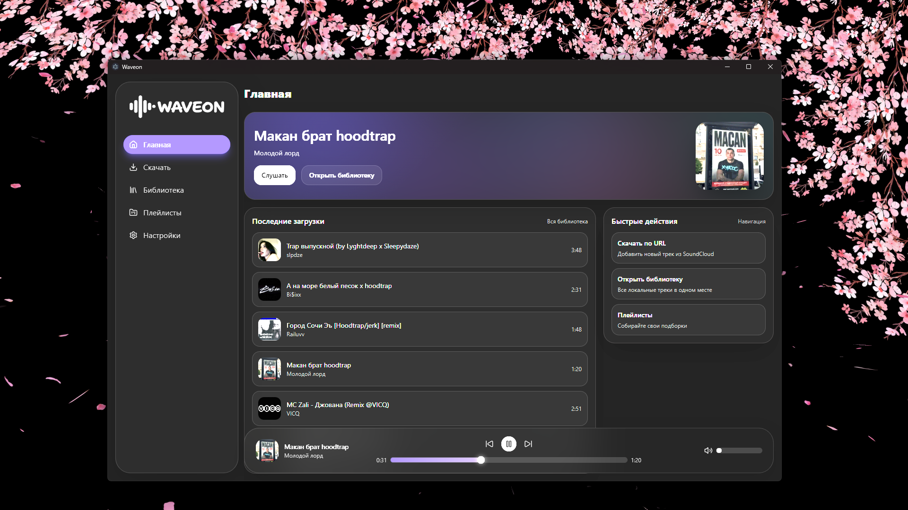

# Waveon

Waveon is a desktop music library for Windows built with Electron, React, TypeScript, and SQLite.

[Русская версия](./README.ru.md)

## About

Waveon focuses on a clean local-music workflow:

- importing tracks from links
- managing local library and playlists
- smooth playback with queue controls
- modern animated UI

## Documentation

Full documentation is available in [`docs`](docs):

- English: [`docs/EN`](docs/EN)
- Russian: [`docs/RU`](docs/RU)

Project setup, build, distribution, and technical notes are documented there.

## Downloads

You can download ready-to-use Windows binaries from GitHub Releases:

Download the latest build from [GitHub Releases](https://github.com/lovlygod/waveon/releases/latest).
- `Waveon Beta-1.0.0-x64.exe`

If Windows SmartScreen appears, click **More info** → **Run anyway**.

