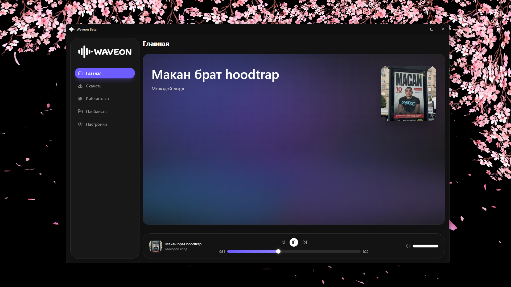

# Waveon

Waveon — это desktop-приложение для локальной музыкальной библиотеки на базе Electron, React, TypeScript и SQLite.

[English version](./README.md)



## Описание

Waveon ориентирован на удобный локальный сценарий:

- импорт треков по ссылке
- управление библиотекой и плейлистами
- воспроизведение с очередью
- современный интерфейс с анимациями

## Документация

Полная документация находится в [`docs`](docs):

- Русский: [`docs/RU`](docs/RU)
- English: [`docs/EN`](docs/EN)

Инструкции по установке, запуску, сборке и структуре проекта вынесены туда.

## Скачать

Готовые Windows-сборки публикуются в Releases:

- [Последний релиз на GitHub](https://github.com/lovlygod/waveon/releases/latest)
- Файл: `Waveon Beta-1.0.0-x64.exe`

Если Windows SmartScreen показывает предупреждение: **Подробнее** → **Выполнить в любом случае**.

## Быстрый старт (для разработки)

```bash
npm install
npm run dev
```

## Сборка

- Production build: `npm run build`
- Windows `.exe`: `npm run dist`

Артефакты сборки находятся в папке [`release`](release).

